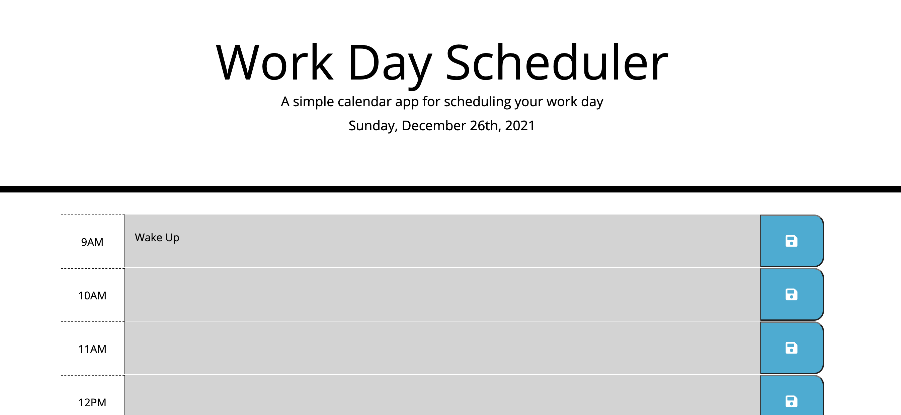
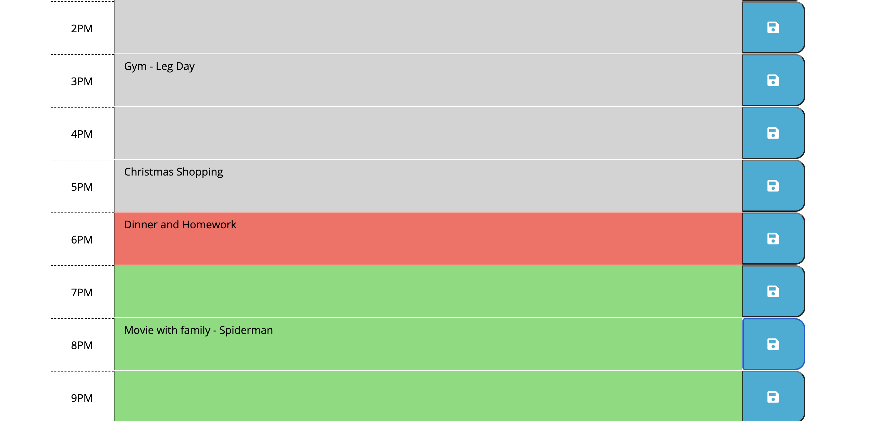

# Workday Scheduler - Challenge 5

## Description
Created a website that allows user to enter tasks for the day which then persist on page even when refreshed through the use of localStorage. Application is also color coded to alert user if the task is occurring in the past, present or future.

## Built With
* HTML
* CSS
* JavaScript
* Bootstrap
* jQuery
* Moment JS

## Website Link
https://rdenton3.github.io/workdayScheduler/

## Photos

